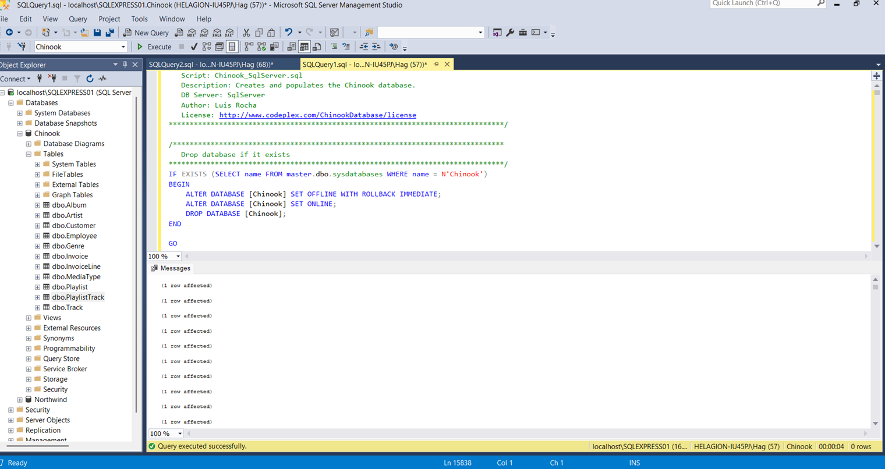
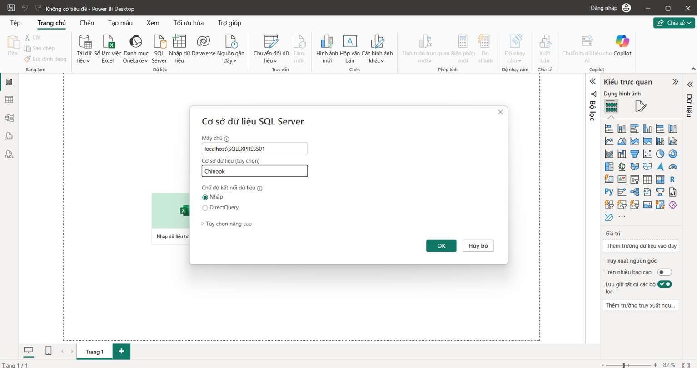
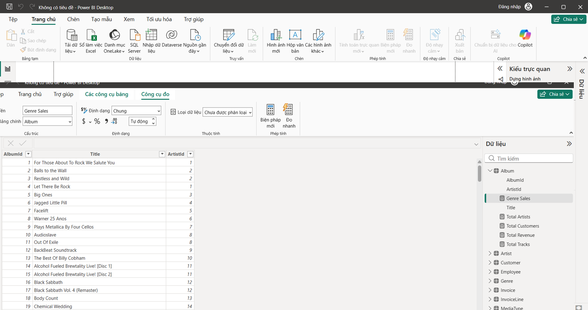
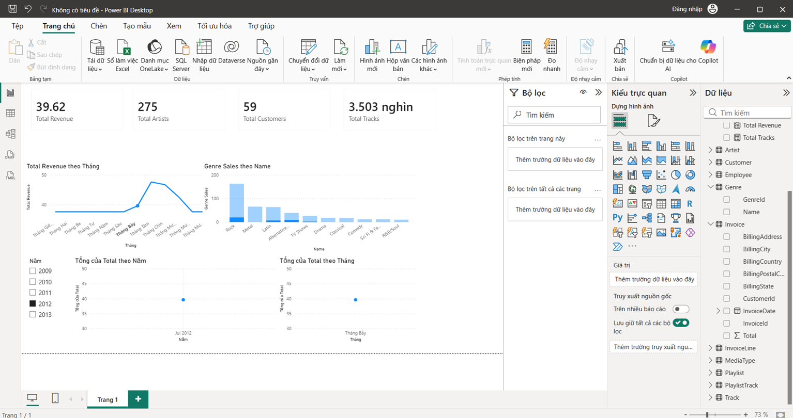

# 第2次練習題目-練習-PC2
>
>學號：112111234
><br />
>姓名：阮陳家興
>


本份文件包含以下主題：(至少需下面兩項，若是有多者可以自行新增)
- [x] 說明內容

## 說明程式與內容

開始寫說明，該說明需說明想法，
並於之後再對上述想法的每一部分將程式進一步進行展現，
若需引用程式區則使用下面方法，
若為.cs檔內程式除了於敘述中需註明檔案名稱外，
還需使用語法` ```語言種類 程式碼 ``` `，其中語言種類若是要用python則使用py，java則使用java，C/C++則使用cpp，
下段程式碼為語言種類選擇csharp使用後結果：

```csharp
public void mt_getResult(){
    ...
}
```

若要於內文中標示部分網頁檔，則使用以下標籤` ```html 程式碼 ``` `，
下段程式碼則為使用後結果：

```html
<%@ Page Language="C#" AutoEventWireup="true" ...>

<!DOCTYPE html>

<html xmlns="http://www.w3.org/1999/xhtml">
<head runat="server">
<meta http-equiv="Content-Type" ...>
    <title></title>
</head>
<body>
    <form id="form1" runat="server">
        <div>
        </div>
    </form>
</body>
</html>
```
更多markdown方法可參閱[https://ithelp.ithome.com.tw/articles/10203758](https://ithelp.ithome.com.tw/articles/10203758)

請在撰寫"說明程式與內容"該塊內容，請把原該塊內上述敘述刪除，該塊上述內容只是用來指引該怎麼撰寫內容。

1. 

Ans: 
# Topic 5：Power BI 與 Chinook 資料庫分析

## 一、建立 Chinook 資料庫

首先安裝 Microsoft SQL Server 與 SQL Server Management Studio (SSMS)。

開啟 SSMS，建立新的查詢(New Query)，將老師提供的 **Chinook_SQLServer.sql** 內容全部貼上後執行，成功建立 Chinook 資料庫。



---

## 二、匯入 Power BI

開啟 Power BI Desktop。

依序選擇：

> 首頁 → SQL Server

輸入

* 伺服器(Server)：`localhost\SQLEXPRESS01`
* 資料庫(Database)：`Chinook`

登入方式選擇 Windows Authentication。



---

## 三、載入所有資料表

成功連線後，在 Navigator 中勾選 Chinook 資料庫所有資料表。

完成後按 **載入(Load)**。



---

## 四、建立報表

建立四個 KPI Card：

* Total Revenue
* Total Artists
* Total Customers
* Total Tracks

接著建立：

* Revenue by Month（折線圖）
* Genre Sales by Name（長條圖）


---

## 五、建立 Slicer

新增一個 Slicer。

使用：

> Invoice → InvoiceDate → Year

作為年份篩選器。



---

## 六、設定 Edit Interactions

點選年份 Slicer。

依序選擇：

> 格式(Format) → 編輯互動(Edit Interactions)

將兩個圖表皆設定為 **Filter**。

如此當使用者選擇不同年份時，所有圖表都會同步更新。


---

# 七、分析結果

本報表使用 InvoiceDate 的 Year 作為篩選條件，分析不同年份的銷售資料。

折線圖顯示各月份的 Total Revenue 變化趨勢。

長條圖則顯示各音樂類型(Genre)的銷售情形。

透過 Edit Interactions，所有圖表皆會依據使用者選擇的年份同步更新，使使用者能快速比較不同年份的銷售表現及音樂類型之間的差異。

---

# 八、結論

利用 Power BI 連接 Chinook 資料庫，可以快速建立互動式商業分析報表。

透過 Slicer 與 Edit Interactions，可以提升資料分析效率，使使用者更容易觀察不同年份及不同音樂類型的銷售變化，作為商業決策的重要依據。

